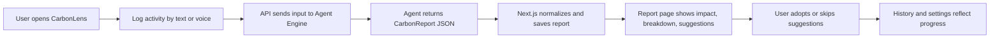
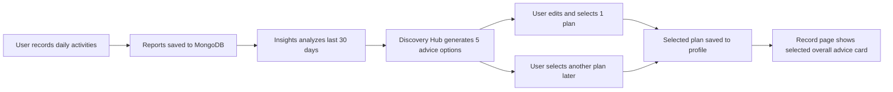
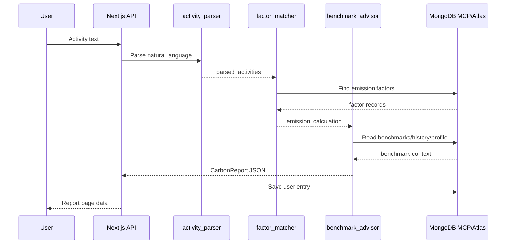
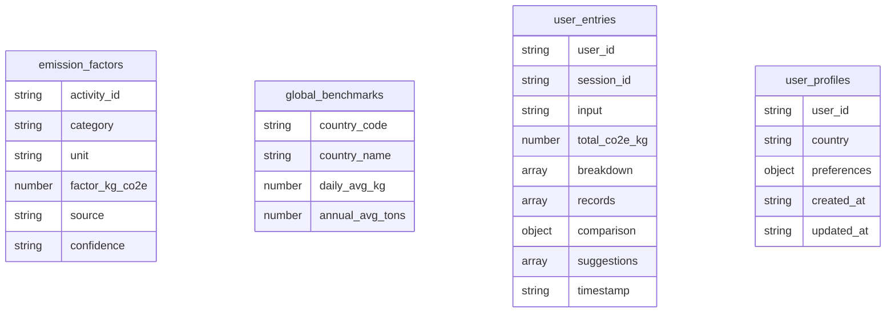
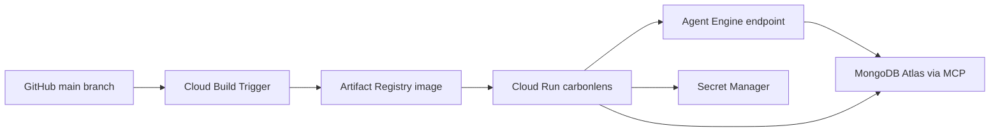
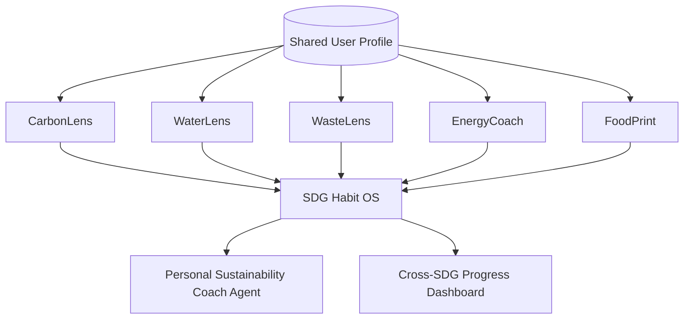

# AI Agent Projects

> Workspace hub for AI agent products, prototypes, reusable patterns, and SDG-related application ideas.

## Projects

| Project | Status | Domain | Primary SDGs | Stack | Repository |
| --- | --- | --- | --- | --- | --- |
| CarbonLens | MVP / Hackathon-ready | Personal carbon intelligence | SDG 12, SDG 13 | Next.js, Google ADK, Gemini Flash, MongoDB Atlas, MongoDB MCP, Cloud Run | https://github.com/KeithHello/CarbonLens |

---

# CarbonLens - AI Carbon Footprint Tracking Agent

## 1. One-Line Summary

CarbonLens turns natural-language daily activity logs into structured carbon footprint reports, benchmark comparisons, personalized reduction suggestions, and saved history.

## 2. Product Positioning

CarbonLens is an English-first AI carbon tracking product for everyday decisions. The current project was built for the Google Cloud Rapid Agent Hackathon 2026, with emphasis on Google ADK, Vertex AI Agent Engine, Gemini Flash, MongoDB Atlas, and MongoDB MCP.

The core product promise:

> Users should be able to say or type what they did today, understand the carbon impact immediately, and receive practical suggestions they can act on today.

## 3. Product Goals

| Goal | Meaning | Current Support |
| --- | --- | --- |
| Natural input | Users describe activities in plain language instead of filling forms | Text input and browser speech recognition |
| Fast understanding | Convert messy activity text into normalized carbon records | Agent parser and deterministic mock fallback |
| Transparent report | Show total CO2e, category breakdown, records, benchmark comparisons, and tree reference | Report page, pie chart, gauge, record details |
| Habit formation | Preserve recent entries, history, accepted suggestions, and preferences | MongoDB history plus local settings and feedback |
| Demo reliability | Run without cloud setup in local mock mode, and integrate with Agent Engine in production | `AGENT_ENGINE_URL` switch and mock report generator |

## 4. User Experience Design

### Primary User Flow



### Main Screens

| Screen | Purpose | Key UI Elements | Product Role |
| --- | --- | --- | --- |
| `/` Home | Introduce the product and demo value | Product pitch, stats, feature cards, CTA | Entry point and hackathon narrative |
| `/input` Record | Capture daily carbon-footprint activities with text or voice | Text area, examples, category hints, microphone, recent entries, selected advice card | Main workflow start |
| `/voice` Voice | Dedicated voice-first logging | Speech recognition controls | Accessibility and low-friction input |
| `/report` Report | Explain the carbon footprint result | Total CO2e, pie chart, comparison, records, suggestions, feedback | Main value delivery |
| `/history` Insights | Show progress, patterns, and recent 30-day emission drivers | 7/30-day toggle, chart/list modes, category trends, color-coded entries | Habit and trend feedback |
| `/advice` Discovery Hub | Let users review, edit, and choose one recommended reduction plan | Five trend-based suggestions, short/mid/long-term plan, edit and replace actions | Action planning and engagement |
| `/settings` Profile | Manage preferences and adopted actions | Country, diet, transport, selected advice, suggestion adoption stats | Personalization foundation |

### Navigation Naming Decision

Use the following menu labels:

```text
Record | Insights | Discovery Hub | Profile
```

| Menu Label | Meaning | Why This Name |
| --- | --- | --- |
| Record | Daily activity capture for carbon-footprint records | More accurate than "Log"; this is a personal footprint record, not a system log |
| Insights | History plus trend interpretation | More active than "History"; invites users to understand patterns |
| Discovery Hub | Place to explore and choose reduction plans | Feels participatory and broader than passive "Advice" |
| Profile | Preferences, country, lifestyle, selected plan | More personal and user-centered than "Settings" |

## 4.5 Trend-Based Advice Model

### Product Decision

Advice should be based on the user's overall carbon-footprint state, especially the last 30 days of lifestyle patterns. It should not be displayed as separate advice under each individual carbon record.

Each activity record should focus on the activity detail and calculation context. The selected reduction plan should be managed in Discovery Hub and shown as one compact "overall advice card" on the Record screen.

### Advice Experience Flow



### Discovery Hub Requirements

| Requirement | Description |
| --- | --- |
| Basis | Advice is generated from the last 30 days of records, category mix, trend direction, benchmark comparison, and user profile |
| Count | Show 5 advice options |
| Selection | User can select exactly 1 active advice plan |
| Replacement | Selecting a different plan replaces the current active plan |
| Editing | User can edit the suggested text and action steps before confirming |
| Time horizons | Each plan contains short-term, mid-term, and long-term actions |
| Record integration | Record page shows only the currently selected plan as an overall advice card |
| Scope | Advice belongs to the user profile/current footprint pattern, not to individual records |

### Advice Plan Structure

| Field | Meaning |
| --- | --- |
| `id` | Stable plan identifier |
| `title` | User-facing advice title |
| `summary` | Short explanation of why this plan is recommended |
| `primary_driver` | Main 30-day emission driver, such as Food or Transport |
| `evidence` | Trend evidence from the last 30 days |
| `short_term_action` | Action the user can try today or this week |
| `mid_term_action` | Habit change for the next 2-4 weeks |
| `long_term_action` | Lifestyle or system change over 1-3 months |
| `estimated_reduction_kg` | Expected reduction estimate |
| `difficulty` | easy, medium, or hard |
| `user_edited` | Whether the user customized the plan |
| `selected_at` | When this became the active plan |

### Example Advice Cards

| Rank | Title | Short-Term | Mid-Term | Long-Term |
| --- | --- | --- | --- | --- |
| 1 | Replace one high-carbon meal pattern | Swap one beef meal this week | Set two lower-carbon meal days per week | Build a default low-carbon meal routine |
| 2 | Shift repeated car trips | Replace one short car trip with transit/walking | Batch errands twice a week | Rework commute or regular route choices |
| 3 | Smooth home energy peaks | Adjust AC by 1-2 degrees today | Air-dry laundry once per week | Improve appliance and insulation habits |
| 4 | Reduce delivery emissions | Combine one delivery order this week | Set a weekly delivery window | Prefer local pickup or lower-packaging providers |
| 5 | Lower digital/service footprint | Reduce unnecessary HD streaming today | Clean unused cloud storage monthly | Build lower-impact travel and service routines |

### Record Page Overall Advice Card

The Record page should show one compact card, not five suggestions:

```text
Your active reduction plan
Replace one high-carbon meal pattern
Short-term: Swap one beef meal this week.
Change plan in Discovery Hub
```

This card should update immediately after the user selects or edits a different plan in Discovery Hub.

### Visual Design Language

| Area | Design Choice | Reason |
| --- | --- | --- |
| Palette | Green primary with neutral gray UI and orange/red severity accents | Climate association plus clear risk levels |
| Typography | Inter, compact dashboard-style hierarchy | Friendly but operational |
| Components | Cards, charts, badges, buttons, segmented controls | Makes carbon data scannable |
| Data visualization | Pie chart, bar chart, gauge-style comparison, color-coded history | Helps users understand relative impact quickly |
| Tone | Practical, action-oriented English | Encourages behavior change without guilt-heavy messaging |

## 5. Current System Architecture

```mermaid
flowchart TB
  U[Browser User] --> UI[Next.js 14 App Router UI]
  UI --> API[/api/carbon/calculate]
  API --> AE[Vertex AI Agent Engine]
  AE --> ADK[Google ADK SequentialAgent]
  ADK --> P[activity_parser]
  P --> M[factor_matcher]
  M --> B[benchmark_advisor]
  M --> MCP[MongoDB MCP Server]
  B --> MCP
  MCP --> DB[(MongoDB Atlas)]
  DB --> EF[emission_factors]
  DB --> GB[global_benchmarks]
  DB --> UE[user_entries]
  DB --> UP[user_profiles]
  API --> UE
  UI --> H[/api/carbon/history]
  UI --> R[/api/carbon/report]
  H --> DB
  R --> DB
```

## 6. Technology Stack

| Layer | Technology | Purpose |
| --- | --- | --- |
| Frontend | Next.js 14 App Router, React 18, TypeScript | Web app and API routes |
| Styling | Tailwind CSS | Responsive dashboard UI |
| Charts | Chart.js, react-chartjs-2 | Pie, line, and bar charts |
| Voice | Web Speech API | Browser-native speech-to-text |
| Agent Framework | Google ADK | Multi-agent orchestration |
| Model | Gemini Flash | Parsing, matching, advising, JSON report generation |
| Agent Runtime | Vertex AI Agent Engine / Agent Platform | Hosted agent execution |
| Data | MongoDB Atlas | Emission factors, benchmarks, report history, profiles |
| Tool Layer | MongoDB MCP Server | Agent-side factor and benchmark access |
| Deployment | Docker, Cloud Build, Cloud Run | Production frontend/API deployment |

## 7. Agent Design

### Agent Identity

CarbonLens is defined as an AI agent that turns everyday activities into carbon footprint reports. It must parse activities, estimate emissions, compare against benchmarks, suggest reductions, and return strict JSON only.

Key constraints:

| Constraint | Description |
| --- | --- |
| User-facing language | English |
| Output format | Raw valid JSON only |
| Schema | Must match `CarbonReport` exactly |
| Categories | Transport, Food, Energy, Consumer Goods, Waste, Services & Digital Life |
| MongoDB use | Prefer MCP lookup for factors, benchmarks, profiles, and history |
| Fallback | Use reasonable defaults when quantity or tool access is missing |

### Active Agent Workflow



### Agent Stages

| Stage | Type | Responsibility | Output |
| --- | --- | --- | --- |
| `activity_parser` | LLM Agent | Parse Chinese, English, or Japanese activity text; extract quantities, units, assumptions | `parsed_activities` |
| `factor_matcher` | LLM Agent with MongoDB MCP | Match activity IDs, retrieve factors, calculate per-activity and category CO2e | `emission_calculation` |
| `benchmark_advisor` | LLM Agent with MongoDB MCP | Compare global/national/personal benchmarks and generate suggestions | `carbon_report` |

### CarbonReport Schema

| Field | Meaning |
| --- | --- |
| `total_co2e_kg` | Total daily carbon footprint estimate |
| `breakdown` | Category-level emissions and percentages |
| `records` | Activity-level records for deletion/detail display |
| `comparison` | Global, national, and personal comparison values |
| `suggestions` | Ranked reduction suggestions |
| `trees_needed` | Cedar-tree reference equivalent |
| `session_id` | Stable report session identifier |
| `timestamp` | ISO time of report |
| `tier_label` | Emissions severity label |
| `anomaly_flag` | Trend or spike warning when applicable |

## 8. Carbon Logic

### Categories and Examples

| Category | Example Activities |
| --- | --- |
| Transport | gasoline car, highway driving, bus, subway, Shinkansen, short flight, walking, bicycle |
| Food | beef, pork, chicken, salmon, rice, tofu, vegetables, coffee |
| Energy | air conditioning, heating, washing machine, dryer, shower, bath |
| Consumer Goods | fast-fashion T-shirt, jeans, sneakers, smartphone |
| Waste | landfill waste, plastic bottle recycling |
| Services & Digital Life | HD streaming, video call, online shopping delivery, hotel stay |

### Benchmark Rules

| Benchmark | Daily Value |
| --- | ---: |
| Global average | 13.5 kg CO2e/day |
| Japan | 10.0 kg CO2e/day |
| United States | 38.0 kg CO2e/day |
| China | 22.0 kg CO2e/day |
| India | 5.0 kg CO2e/day |

### Tier Labels

| Daily CO2e | Label |
| --- | --- |
| < 3.5 kg | Low emissions |
| 3.5-6.8 kg | Moderate emissions |
| 6.8-15.2 kg | Elevated emissions |
| 15.2-42 kg | High emissions |
| > 42 kg | Extreme emissions |

## 9. Data Model



## 10. Current Strengths

| Strength | Why It Matters |
| --- | --- |
| Natural-language first | Lower friction than manual carbon calculators |
| Agent + deterministic fallback | Works both in demo cloud mode and local mock mode |
| MongoDB MCP integration | Strong fit for agent tool use and hackathon track |
| Clear report visualization | Users can see not just a number, but sources and next actions |
| History and feedback loop | Opens path toward personalized sustainability coaching |

## 11. Known Limitations

| Limitation | Impact | Suggested Fix |
| --- | --- | --- |
| Sequential 3-agent chain can be slow | 20-50s latency in full cloud mode | Merge parser/matcher or move factor matching into deterministic code |
| Preferences partly local | Harder to personalize across devices | Persist settings and suggestion feedback in `user_profiles` |
| Voice recognition is browser-dependent | Best in Chrome/Edge | Add fallback UI and mobile-specific testing |
| Carbon factors are demo-scale | Coverage limited to current factor list | Expand factor catalog and source metadata |
| Tree offset can be misunderstood | Users may think offset replaces reduction | Continue framing it as reference, not substitute |

## 12. Deployment Recommendation



| Component | Recommendation |
| --- | --- |
| Frontend/API | Deploy to Cloud Run using Docker |
| Image registry | Prefer Artifact Registry over legacy `gcr.io` |
| Region | Use `asia-northeast1` for Japan-facing frontend; keep Agent region latency in mind |
| Secrets | Store `AGENT_ENGINE_URL`, GCP token, MongoDB URI in Secret Manager |
| Database | Use MongoDB Atlas with separate staging/prod databases |
| Agent | Deploy ADK app to Agent Engine; set min instances to 1 for demos |
| CI/CD | GitHub Actions for checks; Cloud Build trigger for deploy |

## 13. Future Feature Roadmap

### Product Roadmap

| Phase | Feature | Description | Priority |
| --- | --- | --- | --- |
| V1.1 | Persistent user profiles | Store country, diet, transport, suggestion feedback in MongoDB | High |
| V1.1 | Faster calculation path | Move factor lookup/calculation into deterministic API code and keep agent for explanation | High |
| V1.1 | Better mobile voice UX | Improve recording status, permissions, and retry states | Medium |
| V1.2 | Goal setting | Let users set weekly/monthly CO2e targets | High |
| V1.2 | Suggestion habit tracking | Track adopted actions over time and estimate cumulative reduction | High |
| V1.2 | Data source transparency | Show factor source/confidence per activity | Medium |
| V1.3 | Team/community mode | Households, classrooms, teams, or hackathon groups | Medium |
| V1.3 | Multi-language UI | Japanese and Chinese UI, not only input parsing | Medium |
| V1.4 | Receipt/photo input | Extract activities from receipts or photos | Medium |
| V1.4 | Calendar/location integrations | Infer commuting and routine activities with user consent | Low/Medium |

### Agent Roadmap

| Feature | Agent Change | Value |
| --- | --- | --- |
| Deterministic carbon calculator tool | Add a calculation tool called by the agent | Better accuracy and latency |
| Personal coach memory | Read/write user preferences and accepted suggestions | More relevant recommendations |
| Explanation mode | Let agent explain why a factor was selected | Trust and learning |
| What-if simulation | Compare alternatives before user acts | Decision support |
| Anomaly analyst | Detect unusual spikes and ask clarifying questions | Better data quality |

### Data Roadmap

| Dataset | Use |
| --- | --- |
| Region-specific electricity grids | More accurate energy estimates |
| Food portion and restaurant factor library | Better meal estimates |
| Travel distance defaults by city | Better commute inference |
| Product lifecycle factors | Better consumer goods estimates |
| Household profile baselines | Better personalization |

## 14. SDG Alignment

| SDG | Relationship to CarbonLens | Possible Metric |
| --- | --- | --- |
| SDG 12: Responsible Consumption and Production | Helps users understand consumption-related emissions and choose lower-impact alternatives | Adopted suggestions, reduced consumer goods emissions |
| SDG 13: Climate Action | Builds awareness and supports daily carbon reduction | kg CO2e tracked, estimated kg CO2e reduced |
| SDG 11: Sustainable Cities and Communities | Encourages public transit, walking, biking, and lower-carbon commuting | Transport category reduction |
| SDG 7: Affordable and Clean Energy | Encourages efficient cooling, heating, and appliance use | Energy category reduction |

## 15. Related SDG App Ideas

| App Idea | SDG | Agent Role | Data Sources | Relationship to CarbonLens |
| --- | --- | --- | --- | --- |
| WaterLens | SDG 6 | Parse household water use and suggest conservation | Water usage factors, local scarcity data | Same daily logging and habit model |
| WasteLens | SDG 12 | Classify waste habits and guide recycling/composting | Municipal recycling rules, waste factors | Expands CarbonLens waste category |
| EnergyCoach | SDG 7, SDG 13 | Analyze appliance use and suggest energy savings | Utility data, device wattage, grid factors | Deepens CarbonLens energy category |
| CommuteShift | SDG 11, SDG 13 | Compare commute alternatives and build low-carbon routines | Transit APIs, maps, emission factors | Deepens CarbonLens transport category |
| FoodPrint | SDG 2, SDG 12, SDG 13 | Estimate meal impacts and recommend sustainable diets | Food factor libraries, nutrition databases | Deepens CarbonLens food category |
| LocalImpact Map | SDG 11, SDG 13 | Surface nearby sustainable actions and facilities | OpenStreetMap, city data, recycling points | Turns suggestions into real-world actions |
| SDG Habit OS | Multiple SDGs | Multi-agent personal coach for carbon, water, waste, energy, food | Shared user profile and multiple factor datasets | Umbrella product built on CarbonLens architecture |

## 16. Multi-App Platform Vision



The long-term opportunity is not just a single carbon tracker. CarbonLens can become the first module in a broader SDG agent platform:

| Platform Capability | Description |
| --- | --- |
| Shared profile | Country, household size, diet, transport, energy setup, goals |
| Shared activity language | Same text/voice interface across carbon, water, waste, food, and energy |
| Domain-specific factor libraries | Each SDG app has its own database and calculation logic |
| Multi-agent orchestration | Specialist agents handle parsing, calculation, coaching, and planning |
| Unified progress dashboard | Users see cumulative impact across multiple sustainability dimensions |
| Local action layer | Suggestions connect to local services, maps, events, and incentives |

## 17. Next Decisions

| Decision | Options | Recommended Direction |
| --- | --- | --- |
| Latency strategy | Keep 3 agents / merge agents / deterministic calculator | Deterministic calculator plus agent advisor |
| Notion workspace structure | Single page / database / project hub | Project hub: `AI Agent Projects` with CarbonLens as child page |
| SDG product expansion | Build separate apps / shared platform | Start with separate app pages, then unify under SDG Habit OS |
| Deployment | Cloud Run only / Vercel / Cloud Run + Agent Engine | Cloud Run + Agent Engine for Google hackathon fit |

## 18. Suggested Notion Structure

Create this hierarchy:

```text
AI Agent Projects
└── CarbonLens - AI Carbon Footprint Tracking Agent
    ├── Product Design
    ├── Agent Design
    ├── Architecture
    ├── Data Model
    ├── Deployment
    ├── Roadmap
    └── Related SDG App Ideas
```

Recommended Notion properties for the CarbonLens page:

| Property | Value |
| --- | --- |
| Status | MVP / Hackathon-ready |
| Domain | Climate, Sustainability, Personal Analytics |
| Primary SDG | SDG 13 |
| Related SDGs | SDG 12, SDG 11, SDG 7 |
| Stack | Next.js, Google ADK, Gemini Flash, MongoDB, Cloud Run |
| Repository | https://github.com/KeithHello/CarbonLens |
| Last updated | 2026-06-04 |
