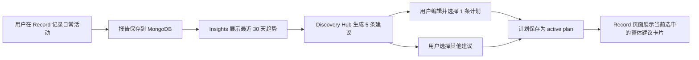

# AI Agent Projects - CarbonLens 中文说明

## 项目定位

CarbonLens 是一个 AI 碳足迹记录与减碳建议应用。用户通过文字或语音记录日常活动，系统会计算碳排放、保存记录、展示趋势，并基于最近 30 天的生活习惯生成减碳计划。

## 最新信息架构

菜单命名采用：

```text
Record | Insights | Discovery Hub | Profile
```

| 菜单 | 中文含义 | 产品职责 |
| --- | --- | --- |
| Record | 记录 | 记录每日活动与碳足迹；显示当前选中的整体减碳计划 |
| Insights | 洞察 | 查看历史记录、趋势、30 天碳足迹状态 |
| Discovery Hub | 探索中心 | 基于最近 30 天记录生成 5 条趋势式建议，供用户选择和编辑 |
| Profile | 个人档案 | 管理国家、饮食、交通偏好，并查看当前选择的减碳计划 |

## 趋势式建议设计

建议不再附着在每条碳记录下面，而是基于整体的 30 天碳足迹状态生成。

### 核心规则

| 规则 | 说明 |
| --- | --- |
| 数据范围 | 最近 30 天的 Record 数据 |
| 建议数量 | 每次展示 5 条建议 |
| 选择规则 | 用户只能选择 1 条当前 active plan |
| 替换规则 | 选择其他建议后，会替换当前建议 |
| 编辑能力 | 用户可以编辑建议标题、说明、短期/中期/长期行动 |
| 展示位置 | Record 页面只展示当前选中的 1 条整体建议卡片 |
| 更新机制 | Record 增加或变化后，Discovery Hub 重新读取最近 30 天数据并刷新建议 |

## 用户流程



## Advice Plan 数据结构

| 字段 | 含义 |
| --- | --- |
| `id` | 稳定的计划 ID |
| `rank` | 建议排序 |
| `title` | 建议标题 |
| `summary` | 为什么推荐这个建议 |
| `primary_driver` | 主要碳排放来源，例如 Food / Transport / Energy |
| `evidence` | 来自最近 30 天记录的证据 |
| `short_term_action` | 短期可做行动 |
| `mid_term_action` | 中期习惯调整 |
| `long_term_action` | 长期生活方式改变 |
| `estimated_reduction_kg` | 预估每日减排量 |
| `difficulty` | easy / medium / hard |
| `user_edited` | 用户是否修改过建议 |
| `selected_at` | 用户选择该建议的时间 |
| `updated_at` | 建议更新时间 |

## 当前实现状态

| 功能 | 状态 |
| --- | --- |
| 菜单改名为 Record / Insights / Discovery Hub / Profile | 已实现 |
| 新增 Discovery Hub 页面 | 已实现 |
| 基于最近 30 天记录生成 5 条建议 | 已实现 |
| 每条建议包含短期 / 中期 / 长期计划 | 已实现 |
| 用户选择 1 条 active plan | 已实现 |
| 选择其他建议后替换当前建议 | 已实现 |
| 用户编辑建议后保存并选择 | 已实现 |
| Record 页面展示当前 active plan | 已实现 |
| Profile 页面展示当前 active plan | 已实现 |
| Record 变化后建议刷新 | 已实现：Discovery Hub 每次加载/刷新都会重新读取最近 30 天记录 |

## 推荐后续优化

| 优化方向 | 说明 |
| --- | --- |
| 服务端保存 active plan | 当前 active plan 存在浏览器 localStorage，后续可保存到 MongoDB `user_profiles` |
| 新增 `/api/carbon/advice` | 将建议生成从前端移动到 API/Agent 层 |
| Agent 参与趋势分析 | 让 Agent 基于 30 天趋势生成更自然、更个性化的计划 |
| 建议完成度追踪 | 用户可标记短期/中期/长期行动完成情况 |
| 与 Insights 联动 | 在 Insights 中展示当前计划对趋势的影响 |

## 部署建议

推荐混合部署：

| 层 | 推荐平台 | 说明 |
| --- | --- | --- |
| Next.js 前端和 API routes | Vercel | Next.js 原生体验好，适合 demo 和公开展示 |
| ADK Agent | Vertex AI Agent Engine / Cloud Run | Python ADK 与 Agent 编排更适合 Google Cloud |
| 数据库 | MongoDB Atlas | 保存 emission factors、benchmarks、records、profiles |

Vercel 环境变量：

```text
AGENT_ENGINE_URL
GCP_SERVICE_ACCOUNT_TOKEN
MONGODB_URI
```

